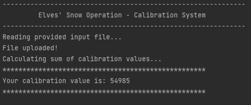
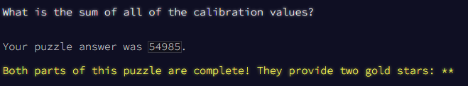

# Advent of Code - Day 1 - Part 1

--- Part Two ---

Your calculation isn't quite right. It looks like some of the digits are actually spelled out with letters: one, two, three, four, five, six, seven, eight, and nine also count as valid "digits".

Equipped with this new information, you now need to find the real first and last digit on each line. For example:

two1nine

eightwothree

abcone2threexyz

xtwone3four

4nineeightseven2

zoneight234

7pqrstsixteen

In this example, the calibration values are 29, 83, 13, 24, 42, 14, and 76. Adding these together produces 281.

What is the sum of all of the calibration values?

## Instructions

Code was programmed using Java 17.0. To run it, place your calibration document inside the "calibrationDocument" folder (a sample is provided in this repository) and then:

```shellscript
Run Application file
```

The calibration value will be shown in the IDE terminal.

## Evidence




